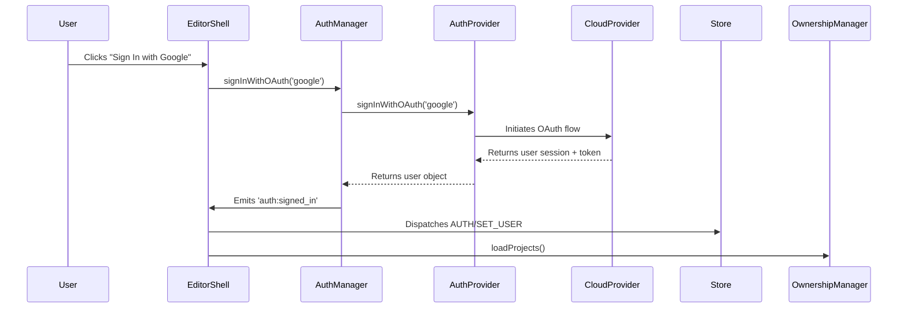
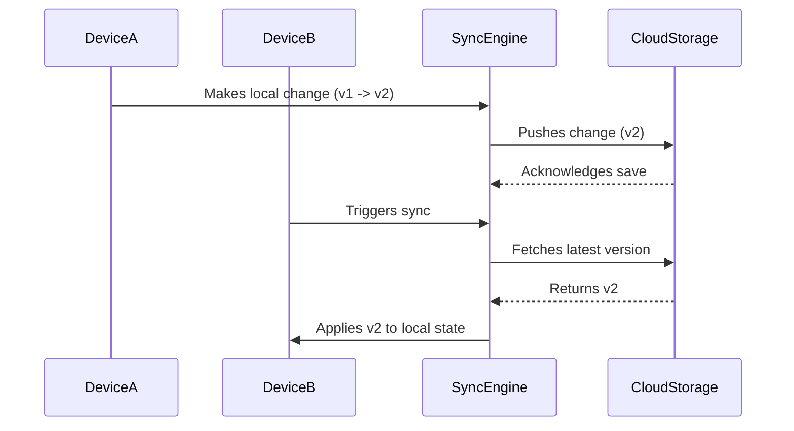
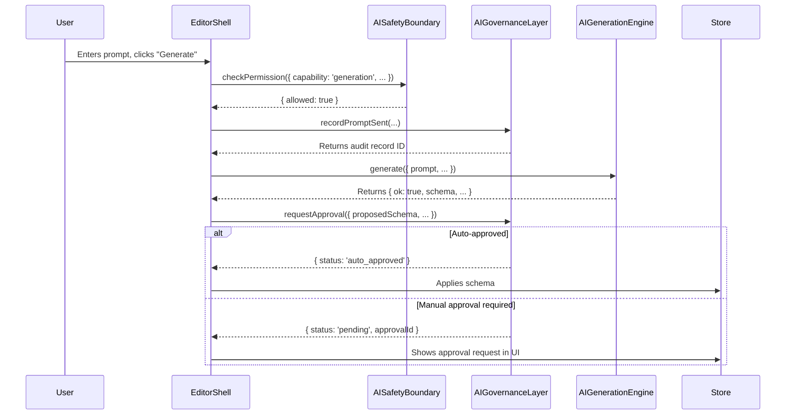

# Nuvra Phase 6: Cloud Sync, Auth & Governance
**Architecture & Threat Model**

**Author**: Manus AI
**Date**: 2026-03-01
**Status**: Complete

---

## 1. Overview

Phase 6 transforms Nuvra from a powerful local-first builder into a **secure, cloud-connected, multi-user platform**. It introduces the foundational layers for collaboration, data persistence beyond a single device, and enterprise-grade governance over AI usage.

The core principle is **Zero Trust**. The system never assumes trust based on network location or actor identity alone. Every action is authenticated, authorized, and audited.

This phase adds four major systems:
1.  **Authentication & Ownership**: Manages users, sessions, and project permissions.
2.  **Cloud Sync & Reconciliation**: Persists project data to the cloud and synchronizes it across devices.
3.  **AI Safety & Governance**: Enforces rules, budgets, and audit trails for all AI operations.
4.  **Secrets Management**: Securely stores and manages API keys and other sensitive credentials.

## 2. System Architecture

The following diagram illustrates how the new systems integrate with the existing foundation.

```mermaid
graph TD
    subgraph User
        A[Browser]
    end

    subgraph Nuvra Editor (Local)
        B[Editor Shell]
        C[State Store]
        D[Persistence Layer]
    end

    subgraph Phase 6 Systems (Local)
        E[Auth Manager]
        F[Sync Engine]
        G[Reconciliation Engine]
        H[AI Safety Boundary]
        I[AI Governance Layer]
        J[Secrets Manager]
    end

    subgraph Cloud Provider (e.g., Supabase)
        K[Auth Service]
        L[Cloud Storage]
        M[Database]
    end

    A -- Interacts with --> B
    B -- Dispatches Actions --> C
    C -- Notifies --> B
    C -- Auto-saves to --> D

    B -- Auth Events (Sign In/Out) --> E
    E -- Updates --> C
    E -- Talks to --> K

    B -- Sync Events --> F
    F -- Uses --> L
    F -- Updates --> C
    F -- Detects Conflicts --> G
    G -- Resolves Conflicts --> C

    B -- AI Generation Events --> H
    H -- Checks Permissions & Budget --> I
    I -- Logs to Audit Trail --> M
    H -- If OK, allows --> AI_Generation_Engine

    AI_Generation_Engine -- Needs Keys --> J
    J -- Retrieves Keys --> AI_Generation_Engine
```

### 2.1. Authentication Flow

Authentication is provider-agnostic. The `AuthManager` uses a configured provider (`LocalAuthProvider` for offline, `SupabaseAuthProvider` for cloud) to handle user identity.



### 2.2. Cloud Sync Flow (Happy Path)

The `SyncEngine` handles bidirectional data synchronization. It uses a "last write wins" strategy by default but flags conflicts for manual resolution.



### 2.3. AI Governance Flow

Every AI operation passes through the `AISafetyBoundary` and the `AIGovernanceLayer`.

1.  **Safety Boundary**: Checks if the user has permission for the capability (e.g., `generation`, `mutation`) and if the operation is within budget.
2.  **Governance Layer**: Records the prompt, requests approval if necessary, and logs the outcome.



## 3. Threat Model & Mitigations

This section outlines potential threats and the architectural decisions made to mitigate them.

| Threat ID | Threat Description | Mitigation Strategy |
| :--- | :--- | :--- |
| **T-01** | **Unauthorized Data Access** | All cloud access requires a valid, short-lived JWT issued by the `AuthManager`. The `OwnershipManager` enforces row-level security policies at the data layer. |
| **T-02** | **Credential Theft** | API keys and secrets are managed by the `SecretsManager`. They are never stored in plain text, never included in the main state tree, and are redacted from all logs. On-device storage uses simple obfuscation (to be hardened with Web Crypto API). |
| **T-03** | **Malicious AI Prompts** | The `securityScanner` performs deterministic checks for prompt injection, harmful content requests, and attempts to exfiltrate data before any prompt is sent to an AI provider. |
| **T-04** | **Unsafe AI Output** | The `securityScanner` also scans all generated schemas for unsafe patterns, such as `eval()` calls, embedded scripts, or unauthorized external resource links. The `schemaRepairLoop` attempts to fix validation errors, but unsafe content is always rejected. |
| **T-05** | **Denial of Service (Cost)** | The `AISafetyBoundary` and `budgetEngine` enforce hard limits on AI token usage and cost per-operation and per-session. This prevents runaway generation from causing unexpected bills. |
| **T-06** | **Data Loss (Sync Conflict)** | The `SyncEngine` never silently overwrites data. If a non-trivial conflict is detected (i.e., both local and remote have changed since the last common ancestor), it is flagged for manual user resolution. |
| **T-07** | **Insecure Direct Object Reference (IDOR)** | All data operations (read, write, delete) are mediated by the `CloudStorage` layer, which validates ownership and permissions via the `OwnershipManager` for every request. A user cannot access a project they are not a member of, even if they know its ID. |
| **T-8** | **Lack of Auditability** | The `AIGovernanceLayer` creates an append-only, immutable audit trail for every significant AI-related event. This provides a complete history for compliance and security reviews. |

## 4. Known Limitations

-   **Secrets Encryption**: The `SecretsManager` currently uses `btoa`/`atob` for obfuscation. This is a placeholder and **MUST** be replaced with the Web Crypto API for true at-rest encryption in a production environment.
-   **Offline Sync Queue**: The offline queue is in-memory. If the user closes the tab while offline, queued changes are lost. This should be persisted to `localStorage`.
-   **Conflict Resolution UI**: The `SyncEngine` detects conflicts, but the UI for presenting and resolving them is not yet built.
-   **Role-Based Access Control (RBAC)**: The `OwnershipManager` supports basic roles (Owner, Admin, Write, Read), but a more granular, customizable RBAC system is needed for complex enterprise scenarios.

---
