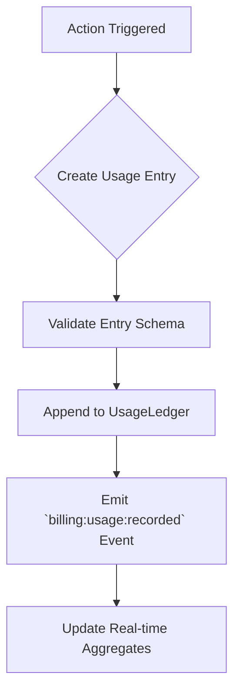
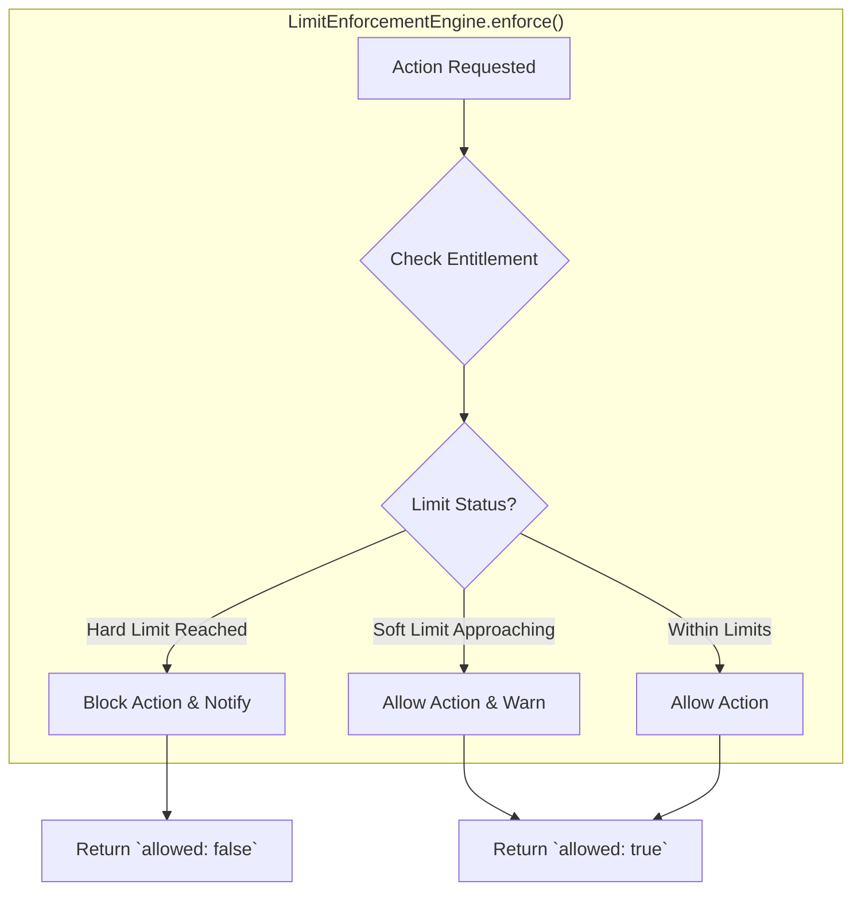

# Nuvra Phase 7: Billing, Usage Governance & Economic Control Layer

**Author**: Manus AI
**Date**: 2026-03-01

## 1. Overview

Phase 7 introduces a production-grade, deterministic, and auditable **Billing, Usage Governance, and Economic Control Layer**. This is not merely a payment processing feature; it is a core governance system designed to provide transparent, predictable, and fair economic controls for both users and the platform.

The system is built on three core principles:

1.  **No Surprise Bills**: Usage is tracked in real-time against explicit plan entitlements. Users are notified of approaching limits and blocked *before* incurring unexpected costs. All AI costs are estimated before execution.
2.  **Everything is Auditable**: Every billable event is recorded in an immutable `UsageLedger`. Every limit enforcement, every AI cost calculation, and every plan transition is traceable.
3.  **Control, Not Just Collection**: The system provides granular controls for AI cost governance, abuse prevention, and enterprise-level budget management. It is designed to manage economic risk, not just process payments.

## 2. Core Modules

The architecture is composed of ten interconnected modules that build upon the Phase 6 foundation.

| Module                      | File(s)                                                                 | Responsibility                                                                                             |
| --------------------------- | ----------------------------------------------------------------------- | ---------------------------------------------------------------------------------------------------------- |
| **Usage Ledger**            | `usageLedger.js`, `usageDimensions.js`                                  | The immutable, append-only source of truth for all billable events.                                        |
| **Plan & Entitlement**      | `planDefinitions.js`, `entitlementManager.js`                           | Defines all subscription plans and their associated capability limits (entitlements).                      |
| **Limit Enforcement**       | `limitEnforcementEngine.js`                                             | Enforces hard and soft limits defined by plans. Blocks actions or issues warnings.                         |
| **AI Cost Governance**      | `aiCostGovernance.js`                                                   | Provides granular, multi-level budgeting (session, project, month) for all AI-related costs.               |
| **Billing Provider**        | `billingContract.js`, `stripeProvider.js`, `localBillingProvider.js`    | An abstraction layer for payment processors (Stripe, Paddle, etc.), isolating the core logic from provider specifics. |
| **Abuse Detection**         | `abuseDetector.js`                                                      | A real-time engine to detect and throttle patterns of abuse like prompt spam and resource flooding.        |
| **Billing Dashboard**       | `billingDashboard.js`                                                   | The data layer that provides all necessary information for the user-facing billing dashboard.              |
| **Upgrade/Downgrade**       | `upgradeEngine.js`                                                      | Manages plan transitions, calculates prorations, and handles scheduled downgrades.                         |
| **Enterprise Readiness**    | `enterpriseBilling.js`                                                  | Supports organization-level billing, cost centers, and bulk usage exports for enterprise customers.        |

## 3. Key Architectural Flows

### 3.1. The Usage Recording Flow

Every billable action in the system, from executing an AI plan to storing a file, follows this flow. It is designed to be atomic and auditable.

1.  **Action Triggered**: A user performs an action (e.g., runs an AI generation).
2.  **Create Usage Entry**: The responsible service creates a standardized usage entry object, specifying the `dimension` (e.g., `ai.tokens.input`), `quantity`, and `userId`.
3.  **Validate Entry**: The entry is validated against the canonical schema in `usageDimensions.js`. Invalid entries are rejected.
4.  **Append to Ledger**: The validated entry is appended to the in-memory `UsageLedger`. The ledger is append-only; entries are never modified.
5.  **Emit Event**: The ledger emits a `billing:usage:recorded` event, allowing other systems (like the UI) to react.
6.  **Update Aggregates**: The `EntitlementManager` listens for this event and updates its real-time usage aggregates, which are used for limit checking.

### 3.2. The Limit Enforcement Flow

Before any potentially billable action is executed, the `LimitEnforcementEngine` is called. This flow prevents cost overruns.

1.  **Action Requested**: A service requests to perform an action on behalf of a user.
2.  **Check Entitlement**: The `LimitEnforcementEngine` calls the `EntitlementManager` to get the user's current usage against their plan's limit for the requested `dimension`.
3.  **Limit Status**: The engine evaluates the usage percentage against hard and soft limit thresholds (e.g., 100% and 85%).
4.  **Block Action**: If the hard limit is reached, the action is blocked. The engine returns `allowed: false` and emits a `billing:limit:blocked` event.
5.  **Allow & Warn**: If the soft limit is reached, the action is allowed, but the engine emits a `billing:limit:warning` event.
6.  **Allow Action**: If usage is within limits, the action is allowed to proceed.

## 4. Data Models

### 4.1. Usage Ledger Entry Schema

A single, immutable entry in the `UsageLedger`.

| Field        | Type   | Description                                                                 |
| ------------ | ------ | --------------------------------------------------------------------------- |
| `id`         | String | A unique, time-sortable identifier (e.g., `ule_lq5k8e_abc123`).             |
| `dimension`  | String | The canonical usage dimension ID (e.g., `ai.cost.usd`).                     |
| `quantity`   | Number | The amount of usage consumed, in the dimension's native unit.               |
| `userId`     | String | The ID of the user who incurred the usage.                                  |
| `projectId`  | String | The project associated with the usage, if applicable.                       |
| `provider`   | String | The AI or cloud provider used, if applicable.                               |
| `meta`       | Object | Additional structured metadata (e.g., `{ model: 'gpt-4o-mini' }`).          |
| `recordedAt` | String | The ISO 8601 timestamp when the entry was recorded.                         |

### 4.2. Plan Entitlement Matrix (Example)

This table illustrates how entitlements are defined for different plans. The full definition is in `planDefinitions.js`.

| Dimension                 | Unit    | Free Plan | Pro Plan   | Enterprise Plan |
| ------------------------- | ------- | --------- | ---------- | --------------- |
| `ai.tokens.input`         | tokens  | 50,000    | 5,000,000  | Custom          |
| `ai.cost.usd`             | USD     | $0.50     | $50.00     | Custom          |
| `collab.seats`            | seats   | 1         | 5          | Custom          |
| `storage.bytes`           | bytes   | 100 MB    | 50 GB      | Custom          |

## 5. Threat Model & Abuse Prevention

The `AbuseDetector` is a stateful service that tracks user behavior to mitigate common abuse vectors. It is not intended to be a comprehensive security solution but rather a first line of defense against economic drain.

| Threat Vector         | Detection Heuristic                                     | Action Taken                                |
| --------------------- | ------------------------------------------------------- | ------------------------------------------- |
| **Prompt Spam**       | High frequency of identical or near-identical prompts.  | Throttle, then block.                       |
| **Token Flooding**    | A single prompt with an abnormally high token count.    | Block.                                      |
| **Regeneration Loop** | Rapid, repeated regeneration requests for the same resource. | Throttle, then block.                       |
| **Account Cycling**   | (Future) Multiple free accounts created from the same IP. | Flag for manual review.                     |

## 6. Known Limitations

-   **Persistence**: The `UsageLedger` is currently in-memory. It must be backed by a persistent, transactional database (e.g., Supabase) before production deployment. The `SyncEngine` from Phase 6 will be the mechanism for this.
-   **Coupon & Trial Management**: The current system does not have a formal model for applying coupons, discounts, or managing trial periods. This would be an extension of the `UpgradeEngine` and `planDefinitions`.
-   **Real-time Fraud Detection**: The `AbuseDetector` is heuristic-based. A production system would require integration with a dedicated fraud detection service for more sophisticated analysis.

This phase establishes a robust economic foundation, enabling Nuvra to move forward with commercialization while maintaining user trust and platform stability.
